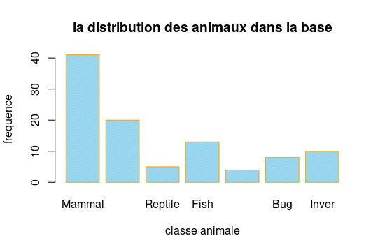

# classification-des-animaux
#****************************************************************************#

###############----Partie 1/:Prediction de la classe d'un animal---############

# Importation de la base et analyse descriptive
```{r, include=F}
library(ggplot2) 
install.packages("readr")
library(readr)
animaux1=read_csv("animaux_I.csv")#contient 18 variables et 101 observations
animaux1
head(animaux1)
str(animaux1)
classe=factor(animaux1$class_type, levels = c(1,2,3,4,5,6,7),
              labels = c("Mammal","Bird","Reptile","Fish","Amphibian","Bug","Inver"))

animaux_C1<-animaux1[which(animaux1$class_type==1),-17] 

dim(animaux_C1) #41

animaux_C2<-animaux1[which(animaux1$class_type==2),-17] 
dim(animaux_C2)#20
animaux_C3<-animaux1[which(animaux1$class_type==3),-17] 
dim(animaux_C3)#5
animaux_C4<-animaux1[which(animaux1$class_type==4),-17] 
dim(animaux_C4)#13
animaux_C5<-animaux1[which(animaux1$class_type==5),-17] 
dim(animaux_C5)#4
animaux_C6<-animaux1[which(animaux1$class_type==6),-17] 
dim(animaux_C6)#8
animaux_C7<-animaux1[which(animaux1$class_type==7),-17] 
dim(animaux_C7)#10
```

# representation graphique:
```{r, include=F}
counts <- table(classe)
barplot(counts, main="la distribution des animaux dans la base",
        xlab="classe animale",ylab = "frequence",
        border="orange",col="skyblue",density=100)
 ```
 
# representation des variable et leurs contribution dans chaque classe
```{r, include=F}
# haire
class=as.factor(animaux1$class_type)
p1 <- ggplot(animaux1, aes(hair , fill =classe )) 
p1 <- p1 + geom_histogram(binwidth = 0.5)
p1 <- p1 + scale_fill_brewer(palette="Set1")
p1 <- p1 + facet_wrap( ~ class_type, ncol=3)
p1 +   scale_x_continuous(breaks = animaux1$ hair)
```

Par exemple pour les animaux qui sont dans la classe des Mammal, la variable hair est dominante donc c’est la variable qui explique mieux cette classe,par contre pour les reptiles tous les animaux qui sont dans cette classe n’ont pas de
cheuveux.
```{r, include=F}

# feathers
p2 <- ggplot(animaux1, aes(x=feathers , fill =classe )) 
p2 <- p2 + geom_histogram(binwidth = 0.5)
p2 <- p2 + scale_fill_brewer(palette="Set1")
p2 <- p2 + facet_wrap( ~ class_type, ncol=3)

p2 +   scale_x_continuous(breaks = animaux1$feathers)
# eggs
p3 <- ggplot(animaux1, aes(x=eggs , fill =classe )) 
p3 <- p3 + geom_histogram(binwidth = 0.5)
p3 <- p3 + scale_fill_brewer(palette="Set1")
p3 <- p3 + facet_wrap( ~ class_type, ncol=3)
p3 +   scale_x_continuous(breaks = animaux1$eggs)

# milk
p4 <- ggplot(animaux1, aes(x=milk , fill =classe )) 
p4 <- p4 + geom_histogram(binwidth = 0.5)
p4 <- p4 + scale_fill_brewer(palette="Set1")
p4 <- p4 + facet_wrap( ~ class_type, ncol=3)
p4 +   scale_x_continuous(breaks = animaux1$milk)
# airbonne
p5 <- ggplot(animaux1, aes(x=airborne , fill =classe )) 
p5 <- p5 + geom_histogram(binwidth = 0.5)
p5 <- p5 + scale_fill_brewer(palette="Set1")
p5 <- p5 + facet_wrap( ~ class_type, ncol=3)
p5 +   scale_x_continuous(breaks = animaux1$airborne)
# aquatic
p6 <- ggplot(animaux1, aes(x=aquatic , fill =classe )) 
p6 <- p6 + geom_histogram(binwidth = 0.5)
p6 <- p6 + scale_fill_brewer(palette="Set1")
p6 <- p6 + facet_wrap( ~ class_type, ncol=3)
p6 +   scale_x_continuous(breaks = animaux1$aquatic)
# predator
p7 <- ggplot(animaux1, aes(x=predator , fill =classe )) 
p7 <- p7 + geom_histogram(binwidth = 0.5)
p7 <- p7 + scale_fill_brewer(palette="Set1")
p7 <- p7 + facet_wrap( ~ class_type, ncol=3)
p7 +   scale_x_continuous(breaks = animaux1$predator)
```
# Correlation 
```{r, include=F}
# install.packages("corrplot")
library(corrplot)
animaux=as.data.frame(animaux1[,-1])
corrplot(cor(animaux))
```
# comparaison entre la classe 7 et la classe1 pour les variables hair et eggs par exemple
```{r, include=F}
tab_hair<-matrix(nrow=2,ncol=2)
tab_hair[1,1]<-sum(animaux_C1$hair==1)
tab_hair[1,2]<-sum(animaux_C1$hair==0)
tab_hair[2,1]<-sum(animaux_C7$hair==1)
tab_hair[2,2]<-sum(animaux_C7$hair==0)
tab_hair
tab_eggs<-matrix(nrow=2,ncol=2)
tab_eggs[1,1]<-sum(animaux_C1$eggs==1)
tab_eggs[1,2]<-sum(animaux_C1$eggs==0)
tab_eggs[2,1]<-sum(animaux_C7$eggs==1)
tab_eggs[2,2]<-sum(animaux_C7$eggs==0)
tab_eggs
```
# Creations de nouvelles colonnes dans le but de mettre 1 devant le type de l'animal
# par exemple si l'animal 1 est un mamel on trouve 1 dans le vecteur mamel sinon 0
```{r, include=F}
data=animaux1
data$Mammal  <- ifelse(data$class_type ==1, 1, 0)
data$Bird  <- ifelse(data$class_type ==2, 1, 0)
data$Reptile  <- ifelse(data$class_type ==3, 1, 0)
data$Fish  <- ifelse(data$class_type ==4, 1, 0)
data$Amphibian  <- ifelse(data$class_type ==5, 1, 0)
data$Bug  <- ifelse(data$class_type ==6, 1, 0)
data$Invertebrate <- ifelse(data$class_type ==7, 1, 0)
data <- subset(data, select = -c(class_type) ) #on enleve la colonne type_class
#install.packages("Information")
library(Information)
#utilisation de la fonction create_infotable
Mammal <- create_infotables(data=data, y="Mammal", ncore=2)
Bird <- create_infotables(data=data, y="Bird", ncore=2)
Reptile <- create_infotables(data=data, y="Reptile", ncore=2)
Fish <- create_infotables(data=data, y="Fish", ncore=2)
Amphibian <- create_infotables(data=data, y="Amphibian", ncore=2)
Bug <- create_infotables(data=data, y="Bug", ncore=2)
Invertebrate <- create_infotables(data=data, y="Invertebrate", ncore=2)

Mammal$Summary[Mammal$Summary$IV >0.05,]#eggs
# Eggs a la plus grande valeur de IV for Mammal  
# donc  eggs joue un element important dans la prediction
# et la classification d'un animal si il est un mamal ou pas
Bird$Summary[Bird$Summary$IV >0.05,]#airebones
Reptile$Summary[Reptile$Summary$IV >0.05,]#venomous
Fish$Summary[Fish$Summary$IV >0.05,]#fins
Amphibian$Summary[Amphibian$Summary$IV >0.05,]#tail
Bug$Summary[Bug$Summary$IV >0.05,]#legs
Invertebrate$Summary[Invertebrate$Summary$IV >0.05,]#tail
```
# transformer toutes les variables en facteur 

```{r, include=F}
animaux1$hair=as.factor(animaux1$hair)
animaux1$feathers=as.factor(animaux1$feathers)
animaux1$eggs=as.factor(animaux1$eggs)
animaux1$milk=as.factor(animaux1$milk)
animaux1$airborne=as.factor(animaux1$airborne)
animaux1$aquatic=as.factor(animaux1$aquatic)
animaux1$predator=as.factor(animaux1$predator)
animaux1$toothed=as.factor(animaux1$toothed)
animaux1$backbone=as.factor(animaux1$backbone)
animaux1$breathes=as.factor(animaux1$breathes)
animaux1$venomous=as.factor(animaux1$venomous)
animaux1$fins=as.factor(animaux1$fins)
animaux1$legs=as.factor(animaux1$legs)                        
animaux1$tail=as.factor(animaux1$tail)
animaux1$domestic=as.factor(animaux1$domestic)
animaux1$catsize=as.factor(animaux1$catsize)
animaux1$class_type=as.factor(animaux1$class_type)
animaux=as.data.frame(animaux1)
animaux=cbind(animaux1$animal_name,animaux1$hair,animaux1$feathers,animaux1$eggs,animaux1$milk,animaux1$airborne,animaux1$aquatic,animaux1$predator,animaux1$toothed,animaux1$backbone,animaux1$breathes,animaux1$venomous,animaux1$fins,animaux1$legs,animaux1$tail,animaux1$domestic,animaux1$catsize,animaux1$class_type)
colnames(animaux)<-c("animal_name","hair","feathers","eggs","milk","airborne","aquatic","predator","toothed","backbone","breathes","venomous","fins","legs","tail","domestic","catsize","class_type")
#animaux=as.data.frame(animaux1[,-1])
animaux=as.data.frame(animaux)
animaux2=animaux
animaux2=as.data.frame(animaux2)
```

# k-means sur toute la base animaux
```{r, include=F}
library(class)
classe_animaux=as.factor(animaux2$class_type)
#animaux2=animaux2[,-18]
animaux2
k=sqrt(17)+1    #choix de k
animaux_kmeans=knn.cv(animaux2[,-1],classe_animaux,k,prob=TRUE)
prediction_classe=animaux_kmeans
mat_class=table(classe_animaux,prediction_classe)
mat_class 
#install.packages("caret")
library(caret)
library(e1071)
#install.packages("e1071")
confusionMatrix(classe_animaux, prediction_classe)#erreur=1-accuracy 14% de mauvaise prediction
```

# division du jeux de donnees 

### etape 1: diviser le jeu de données en deux bases: base apprentissage et base test
```{r, include=F}
set.seed(1234)
animaux2=animaux1
n <- nrow(animaux) # nb de lignes de la base=nombre d'observations
id.appr <- sample.int(n,0.85*n) # tirage aléatoire de numéros de ligne pour constituer l'échantillon d'apprentissage
data.appr <- animaux2[id.appr,] # sélection des lignes pour l'échantillon d'apprentissage
data.appr  #85 observation
dim(data.appr)
```
# nbre d'animaux dans chaque classe pour la base appr (85 observation)
```{r, include=F}
class_train=factor(data.appr$class_type, levels = c(1,2,3,4,5,6,7),
                   labels = c("Mammal","Bird","Reptile","Fish","Amphibian","Bug","Inver"))
counts_train <- table(class_train)
barplot(counts_train, main="la distribution totale des animaux dans la base train",
        xlab="classe animale",ylab = "frequence",
        border="blue",col="skyblue",density=100)
```
# nbre d'animaux dans chaque classe pour la base test 
```{r, include=F}
data.test <- animaux2[-id.appr,] 
dim(data.test)  #16 observation
class_test=factor(data.test$class_type, levels = c(1,2,3,4,5,6,7),
                  labels = c("Mammal","Bird","Reptile","Fish","Amphibian","Bug","Inver"))
counts_test <- table(class_test)
barplot(counts_test, main="la distribution totale des animaux dans la base test",
        xlab="classe animale",ylab = "frequence",
        border="blue",col="skyblue",density=100)
###################
prop.table(table(data.appr$class_type))

prop.table(table(data.test$class_type))
```

# construction de modeles pour la prediction

```{r, include=F}
# fonction qui calcul les erreurs 
erreur=function(pred, vrais){
  mc=table(pred,vrais)
  1-sum(diag(mc))/sum(mc)
}
```

# modele 1/ Arbre de decision:
```{r, include=F}
library(caret)
library(rpart)
#install.packages("rpart.plot")
library(rpart.plot)
#classe_appr=as.factor(data.appr$class_type)
mcart=rpart(as.factor(class_type)~ .,data=data.appr[,-1],cp=0,minbucket=1,maxdepth=30)
predcart1= predict(mcart,newdata=data.test[,-1],type="class")
er1=erreur(predcart1,data.test$class_type)
er1 #0.06
confusionMatrix(data.test$class_type, predcart1)#erreur=1-accuracy
rpart.plot(mcart)#model complexe
plotcp(mcart)
```


# modele 2/ randomforest 
```{r, include=F}
#install.packages("randomForest")
library(randomForest)
model_forest=randomForest(as.factor(class_type)~ .,data=data.appr, importance=TRUE, ntree=7)
predi_class=predict(model_forest,newdata=data.test,type="class")
model_forest$predicted
confusionMatrix(predi_class, data.test$class_type)
#erreur.forest <- erreur(predi_class,data.test$class_type) 
#erreur.forest 
#--les variables les plus importantes 
model_forest$importance[order(model_forest$importance[, 1], decreasing = TRUE)]
varImpPlot(model_forest) 
```
# modele 3/ knn avec le bon choix de k
```{r, include=F}
animaux1=read_csv("animaux_I.csv")
animaux=as.data.frame(animaux1)
################################################################################################
# separer la base:
library(class)
mydata=animaux
index = sample(x = 2,size = nrow(mydata),replace = TRUE,prob = c(0.8,0.2))
train.data = mydata[index==1,]
test.data = mydata[index==2,]
```
################################################################################################
# Modele
```{r, include=F}
knn1 = knn(train = train.data[,2:17],test = test.data[,2:17],cl = train.data[,18],k = 1)
summary(knn1)
table(test.data$class_type,knn1)
accuracy = sum((test.data$class_type==knn1)/length(test.data$class_type))*100
accuracy
```
################################################################################################
```{r, include=F}
knn2 = knn(train = train.data[,2:17],test = test.data[,2:17],cl = train.data[,18],k = 9)
summary(knn2)
table(test.data$class_type,knn2)
accuracy = sum((test.data$class_type==knn2)/length(test.data$class_type))*100
accuracy
```
################################################################################################
```{r, include=F}
knn = list()
accuracy = numeric()
for (i in 1:70) {
  knn = knn(train = train.data[,2:17],test = test.data[,2:17],cl = train.data[,18],k = i,
            prob = TRUE)
  summary(knn)
  table(test.data$class_type,knn)
  accuracy[i] = sum((test.data$class_type==knn)/length(test.data$class_type))
  accuracy
}
```
################################################################################################
```{r, include=F}
plot(x = accuracy,pch = 20,col = "red")
abline(h = max(accuracy))
abline(v = which(accuracy==max(accuracy)))
                                          
summary(knn1)
```
# conclusion : k=1 fournit un bon modéle.


#_____________________________________________________________________________________#

